# Todo-Pomodoro-App

# Built with
- React JS
- React Router
- Redux
- Redux Thunk
- Styled Components
- Firebase & Firestore

아래 링크를 클릭하시면 Pomodoro 화면으로 들어갈 수 있습니다. 
https://hamin7.github.io/TodoList-Pomodoro/ 

데모 영상은 아래 링크로 가시면 됩니다. 
https://www.youtube.com/watch?v=jox3jw_-Gls&feature=youtu.be 

 

처음 접속하면 아래와 같이 로그인 화면이 나타납니다.

 

우측 상단의 SIGNUP을 클릭하여 회원가입을 하시면 됩니다.
인증을 위한 이메일을 입력하시고, 비밀번호는 8자리 이상이어야 합니다.

 

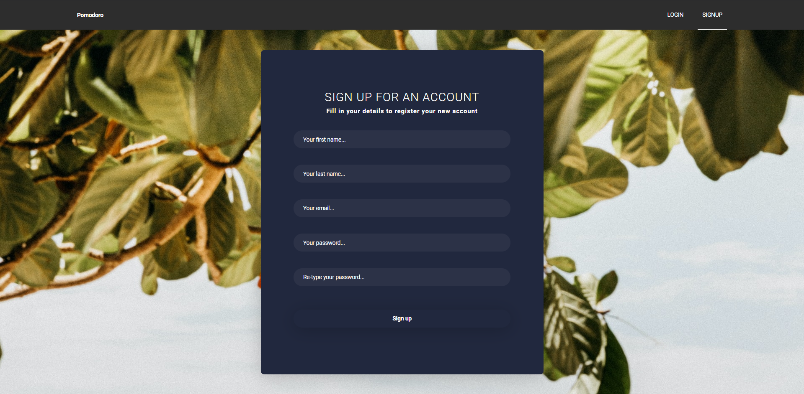

 

올바르게 인증하시면 아래와 같이 메일을 인증하라는 문구가 나옵니다.

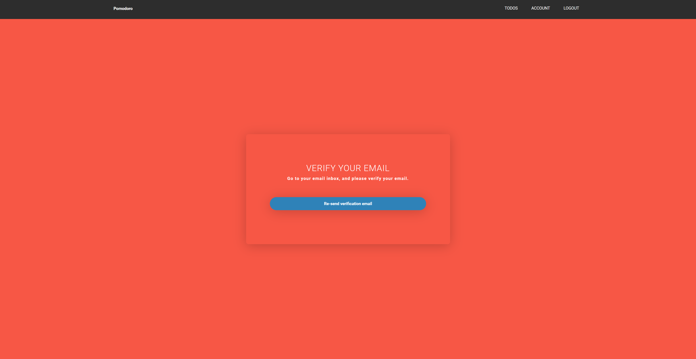

 

입력하신 메일에 들어가시면 아래와 같은 메일이 와있습니다.
링크를 눌러주시면 됩니다.

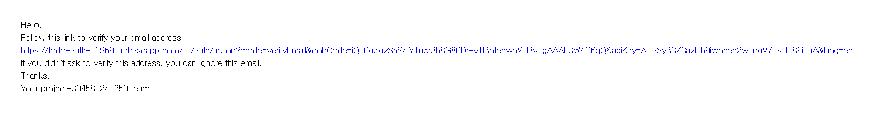

 

링크를 클릭했을 때 아래와 같이 나타난다면 올바르게 회원가입이 완료된 것 입니다.

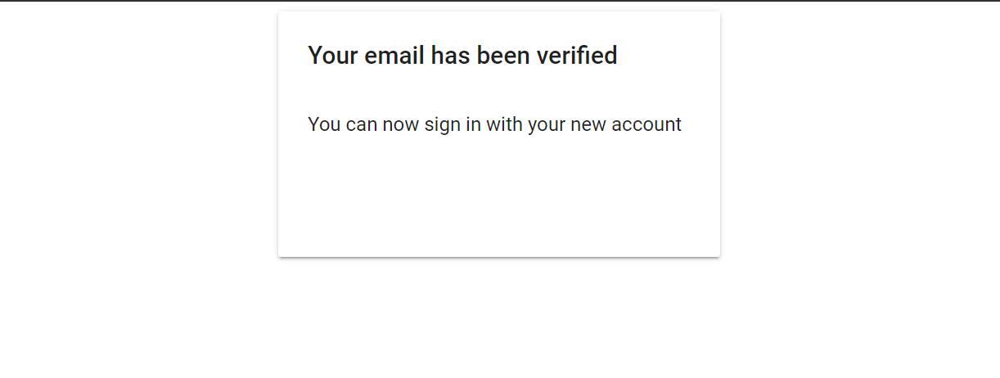

 

그 후 우측 상단의 LOGOUT 버튼을 눌러 주시면 아래와 같은 로그인 창이 나타납니다.

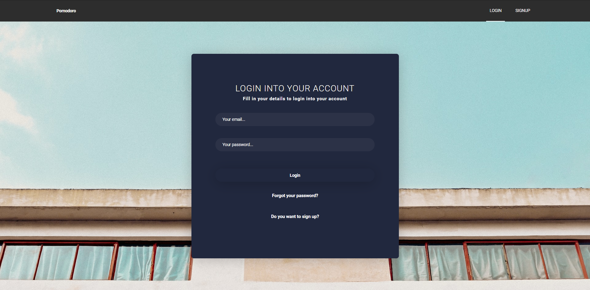

 

가입하신 이메일 주소와 비밀번호를 입력하시면 로그인 할 수 있습니다.

만약 비밀번호를 잊어버리셨다면 하단의 Forgot your password?를 클릭합니다.

아래와 같은 창이 나타날 것이고 가입 시 입력하였던 이메일 주소를 입력하면 비밀번호 재설정 메일을 보내드립니다.

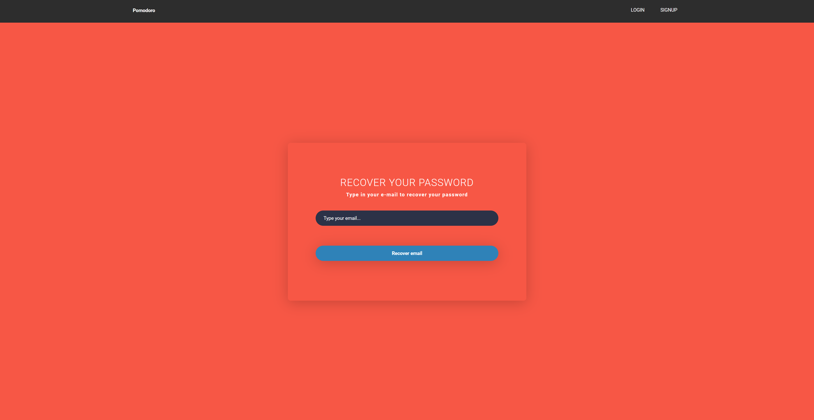

 

아래와 같은 메일을 받으실 수 있고 클릭하시면

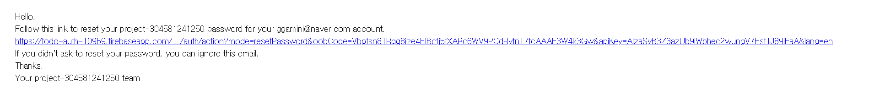

 

아래와 같은 창에서 비밀번호를 재 설정 할 수 있습니다

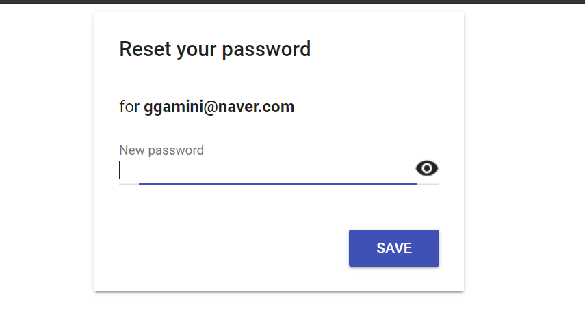

 

이제 설정 된 아이디와 패스워드로 로그인을 하시면 아래와 같은 메인화면이 나타납니다.

아직 입력한 할 일 목록이 없는 상태입니다.

Add Todo를 클릭하시면

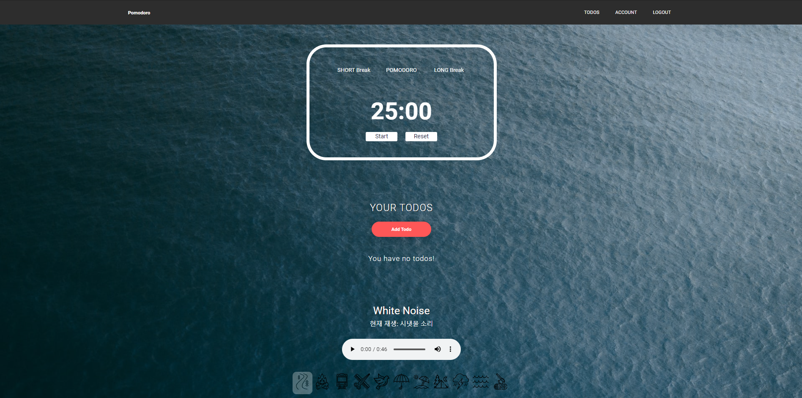

 

할 일을 입력하는 창이 나타납니다.

할 일을 입력하고 Add todo 버튼을 눌러서 저장하시면 됩니다

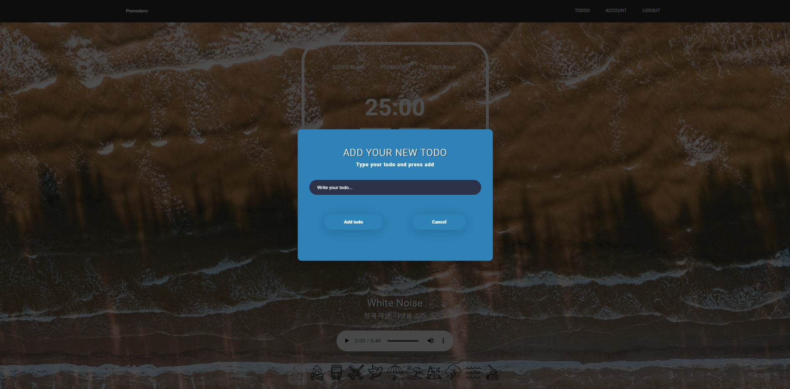

 

위와 같은 방식으로 두 가지 할 일을 추가해 보았습니다.

할 일 이름과, 몇 번의 Pomodoro 진행 횟수, 수정 버튼, 삭제버튼이 나타납니다.

 

이제 지금 할 일을 선택하여 Pomodoro를 진행해보도록 하겠습니다.

할 일을 클릭하시면 선택한 할 일에 This is currentJob이라고 나타납니다.

저는 코드 리팩토링하기 항목을 선택하였습니다.

그리고 타이머에서 POMODORO를 클릭하여 Pomodoro 모드를 시작하겠습니다. (기본 세팅이 25분짜리 Pomodoro 모드입니다) 

 

Start 버튼을 누르시면 코드 리팩토링하기 Todo에 대한 Pomodoro가 실행됩니다.

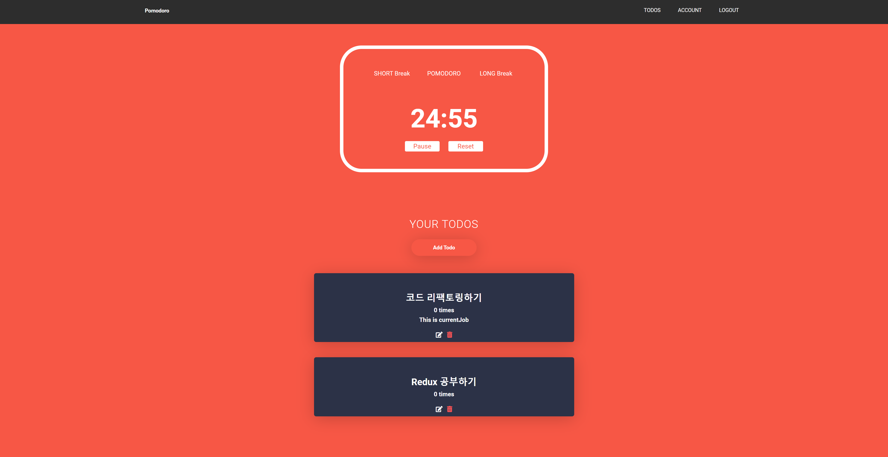

 

아래와 같이 Pomodoro가 한 번 실행되고 나면 해당 Todo 항목의 Pomo 횟수가 1회 증가되어 기록됩니다.

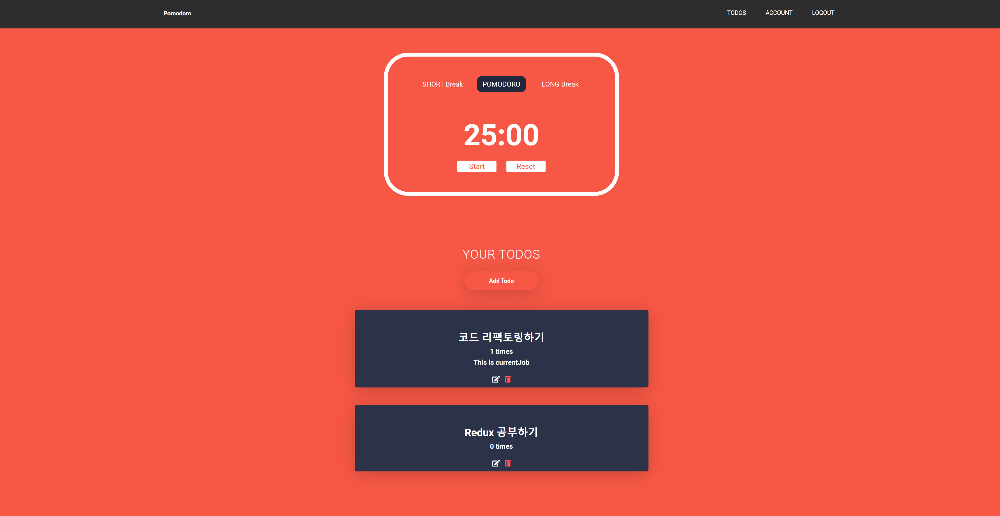

 

타이머 탭을 이용하여 5분짜리 Short Break 모드와 15분 짜리 Long Break 모드도 이용할 수 있습니다.

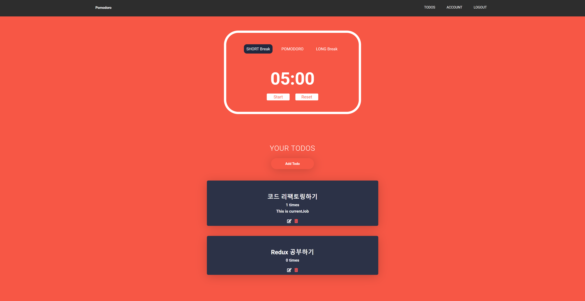

 

ACCOUNT 탭에서 이름, 비밀번호 등 계정 정보를 수정할 수 있습니다.

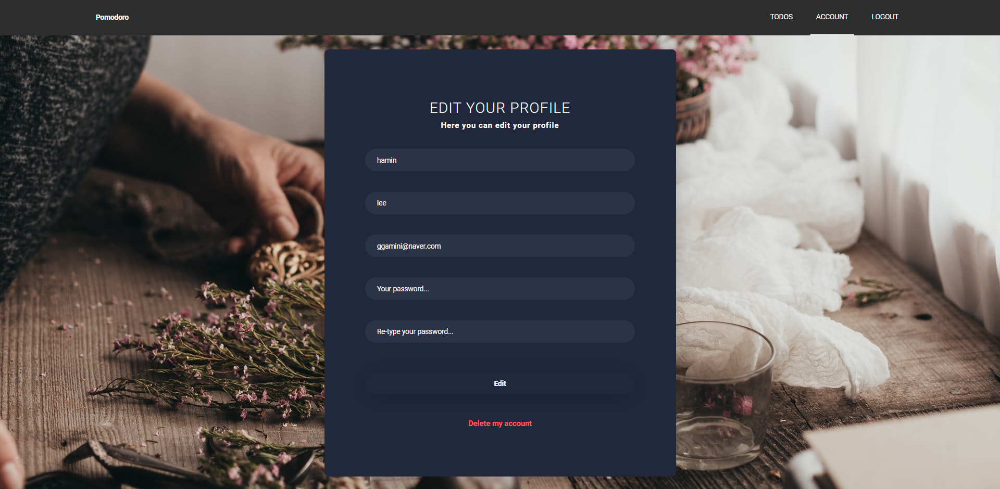

 

새로 고침 시 랜덤으로 배경이 바뀌는 기능도 있습니다.

 

 

 

그리고 집중력 향상을 위해 백색 소음 기능도 사용할 수 있습니다

 
